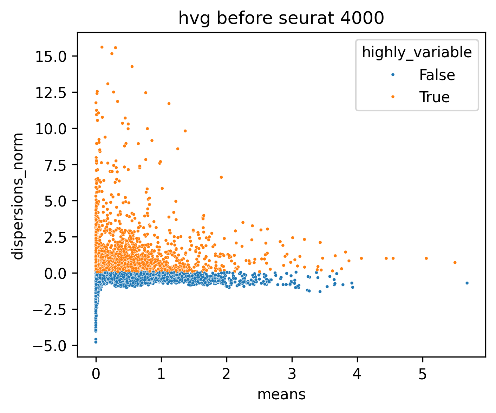
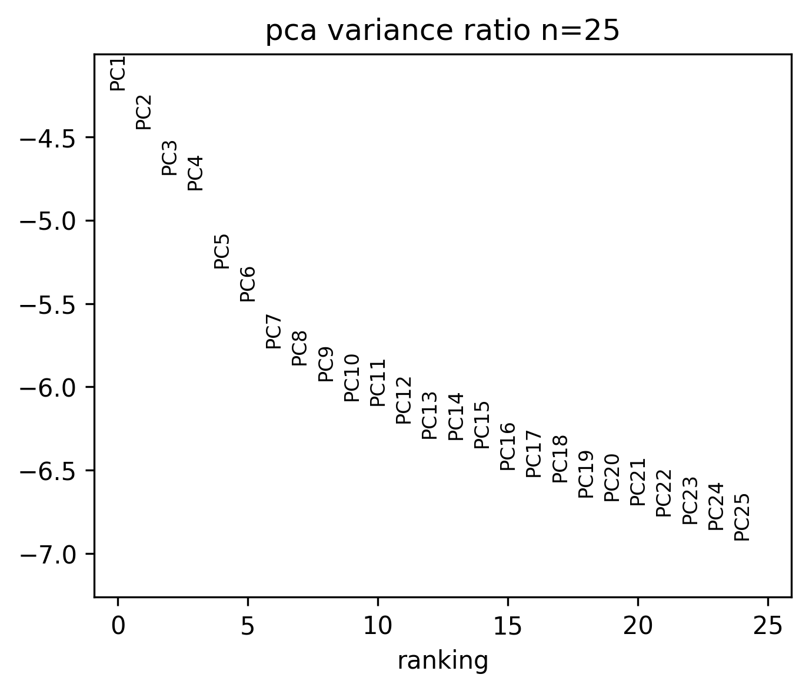
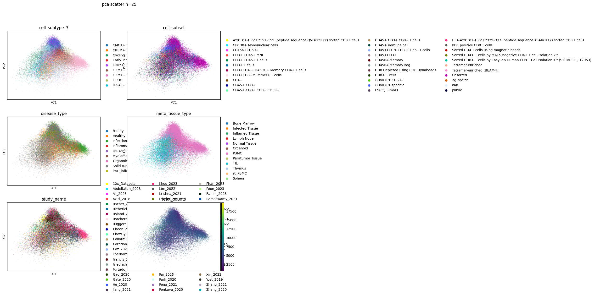
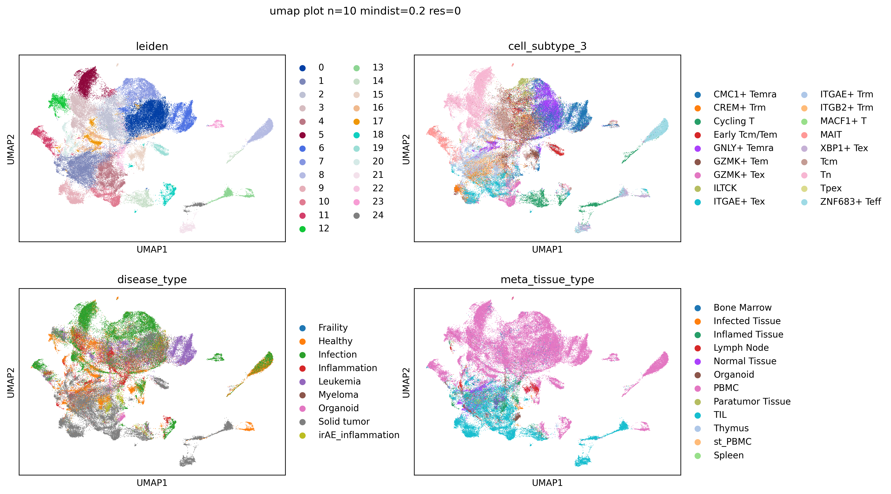
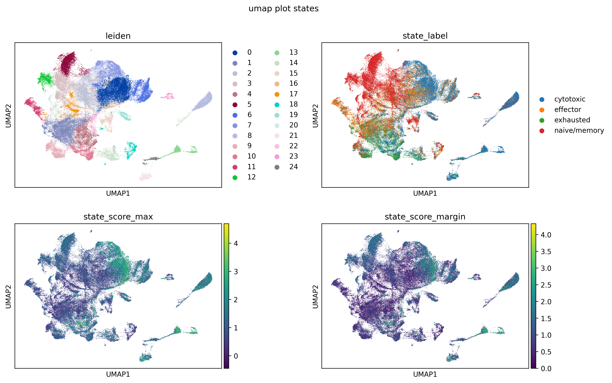
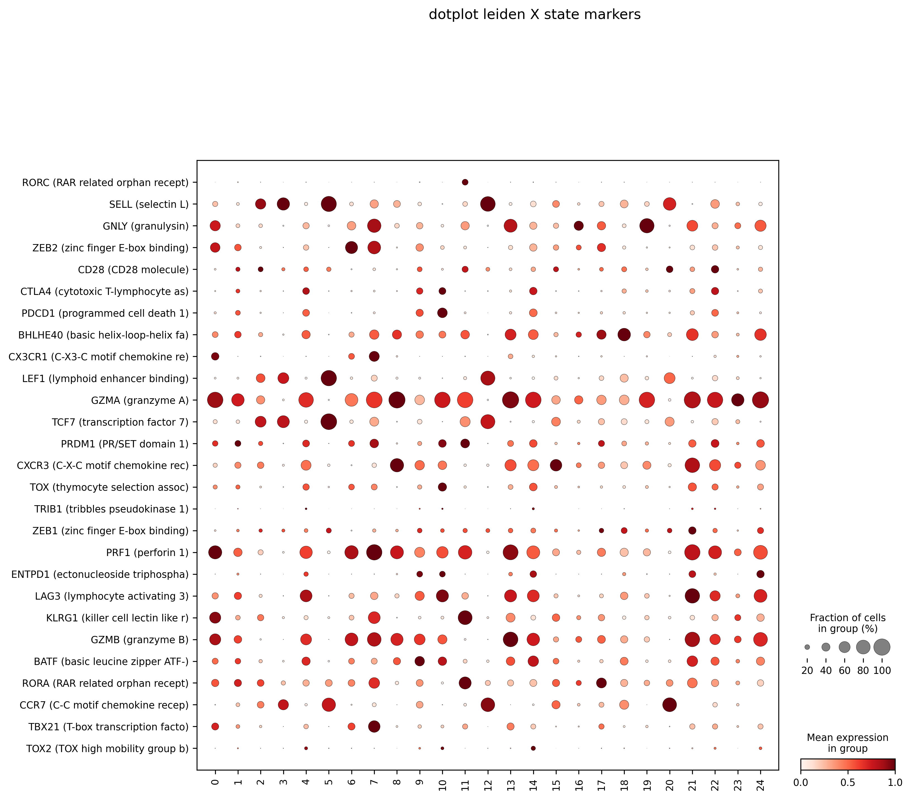

# inhibitory_receptors

- Timestamp: `2026-04-21 06:16:14`
- Source file: `/ceph/project/sharmalab/dnimrich/cd8atlas/code/pipeline_elements.py`

*Loading from [../../data/qc+subsampled_100000.h5ad](../../data/qc+subsampled_100000.h5ad)*

Loaded adata with with shape (91098, 14025)

Preserved existing `counts` layer from loaded adata

Labeled 13256 genes from protein-coding_gene.txt

---
## 3. Feature selection

### 3.3 Highly Variable Gene selection

HVGs selected: 4000 (including 27 whitelisted genes)

### Top 20 expressed genes after selection:

---
## 4. Dimensional reduction

### Principal component analysis (PCA)

Scaled data with max variance cutoff 10

Calculated PCA with 25 components

### UMAP

Calculated nearest 10 neighbours using 25 PCs

Calculated UMAP with min_dist 0.2 and spread 1.0

---
## 5. Clustering

Detected 25 clusters with leiden at resolution 0.6

*Saving into [inhibitory_receptors_20260421_061614_data/adata_umap_clustering_n=10_mindist=0.2_res=0.6.h5ad](inhibitory_receptors_20260421_061614_data/adata_umap_clustering_n=10_mindist=0.2_res=0.6.h5ad)*

> Saved adata with shape (91098, 4000)

### Labeling states based on markers:

| cytotoxic | effector | exhausted | naive/memory |
| --- | --- | --- | --- |
| IFNG | RORC | TOX | 1D3 |
| PRF1 | TBX21 | ENTPD1 | CCR7 |
| GZMA | CX3CR1 | BATF | SELL |
| GZMB | RORA | LAG3 | CXCR3 |
| GNLY | ZEB2 | TIGID | LEF1 |
|  | KLRG1 | TOX2 | TCF7 |
|  | 1D2 | PDCD1 | ZEB1 |
|  | PRDM1 | TRIB1 | CD28 |
|  | BHLHE40 | CTLA4 |  |

State marker genes in dataset: 27 present, 4 missing

Omitted state markers: 1D2, 1D3, IFNG, TIGID

### Assigned state labels:

| state | n_cells | pct_cells |
| --- | --- | --- |
| cytotoxic | 33294.00 | 36.50 |
| naive/memory | 29498.00 | 32.40 |
| effector | 16136.00 | 17.70 |
| exhausted | 12170.00 | 13.40 |

Plotting 27 genes from adata.var[`state_markers_selected`]

---
## 6. FindAllMarkers

### Finding significant genes with FindAllMarkers (via Seurat in R)

FindAllMarkers will use up to 48 R worker(s)
