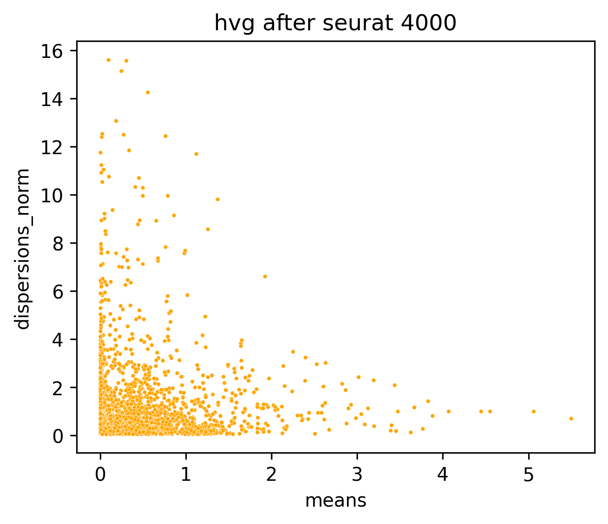

# inhibitory_receptors

- Timestamp: `2026-04-21 06:30:06`
- Source file: `/ceph/project/sharmalab/dnimrich/cd8atlas/code/pipeline_elements.py`

*Loading from [../../data/qc+subsampled_100000.h5ad](../../data/qc+subsampled_100000.h5ad)*

Loaded adata with with shape (91098, 14025)

Preserved existing `counts` layer from loaded adata

Labeled 13256 genes from protein-coding_gene.txt

---
## 3. Feature selection

### 3.3 Highly Variable Gene selection

HVGs selected: 4000 (including 27 whitelisted genes)

### Top 20 expressed genes after selection:

---
## 4. Dimensional reduction

### Principal component analysis (PCA)

Scaled data with max variance cutoff 10

Calculated PCA with 25 components

### UMAP

Calculated nearest 12 neighbours using 25 PCs

Calculated UMAP with min_dist 0.1 and spread 1.0

---
## 5. Clustering

