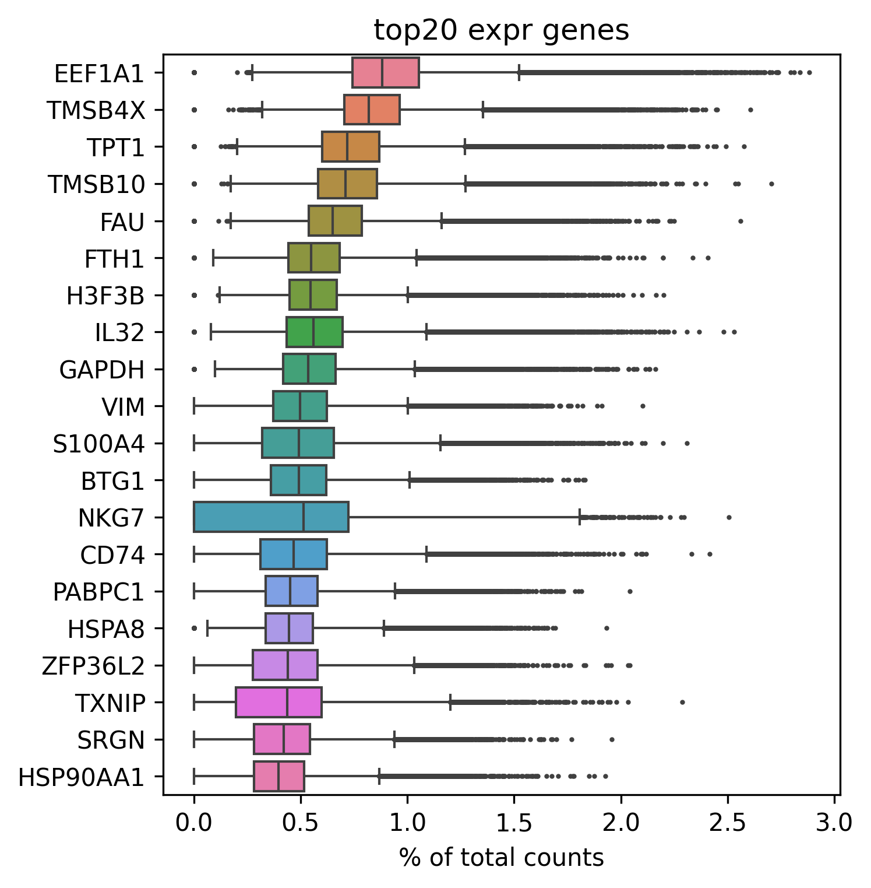

# inhibitory_receptors

- Timestamp: `2026-04-21 07:20:04`
- Source file: `/ceph/project/sharmalab/dnimrich/cd8atlas/code/pipeline_elements.py`

*Loading from [../../data/qc+subsampled_100000.h5ad](../../data/qc+subsampled_100000.h5ad)*

Loaded adata with with shape (91098, 14025)

Preserved existing `counts` layer from loaded adata

---
## 3. Feature selection

### 3.3 Highly Variable Gene selection

HVGs selected: 4000 (including 27 whitelisted genes)

### Top 20 expressed genes after selection:

*Loading from [../../code/inhibitory_receptors/inhibitory_receptor_list.csv](../../code/inhibitory_receptors/inhibitory_receptor_list.csv)*
