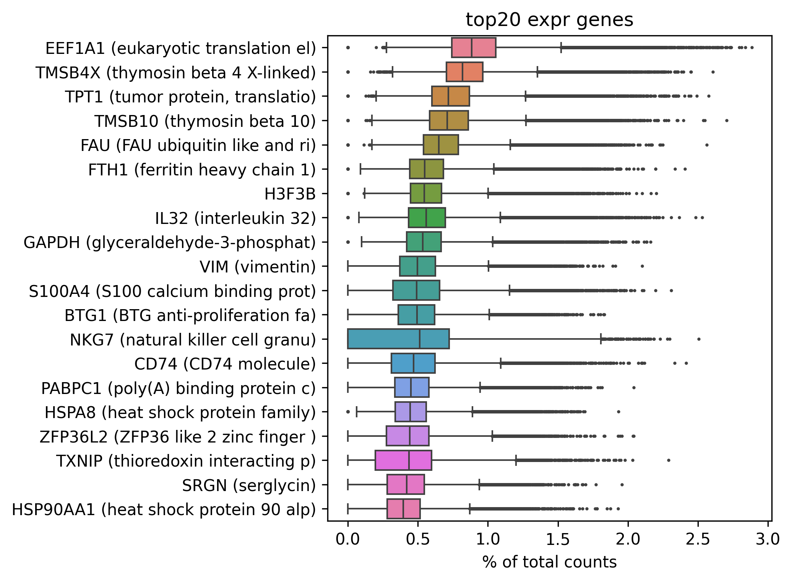
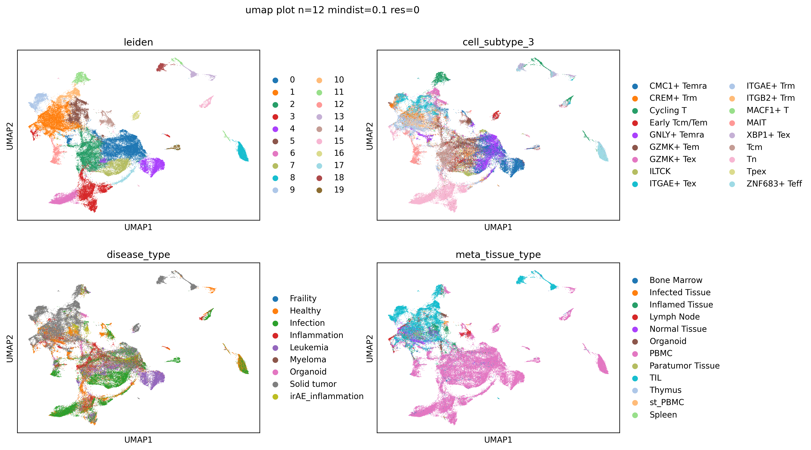
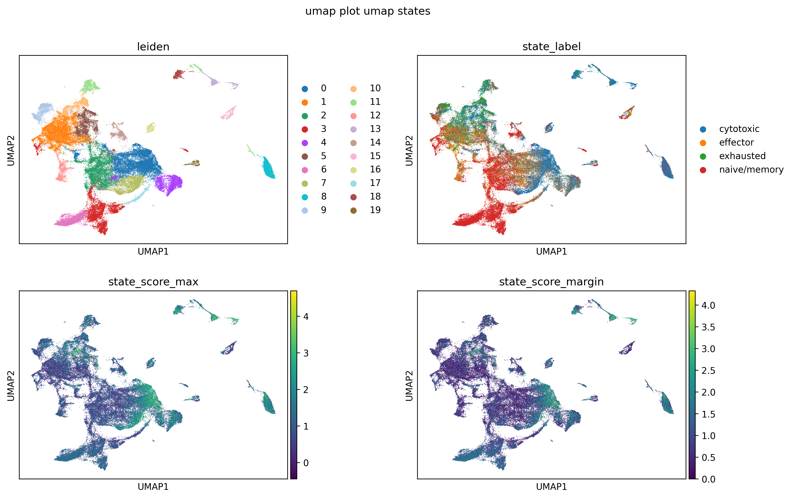
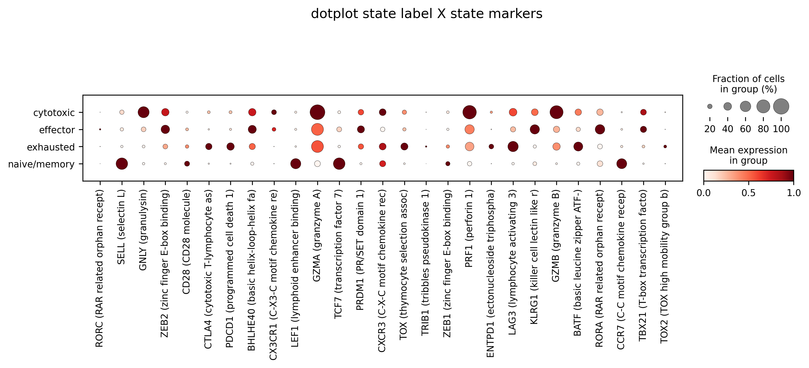
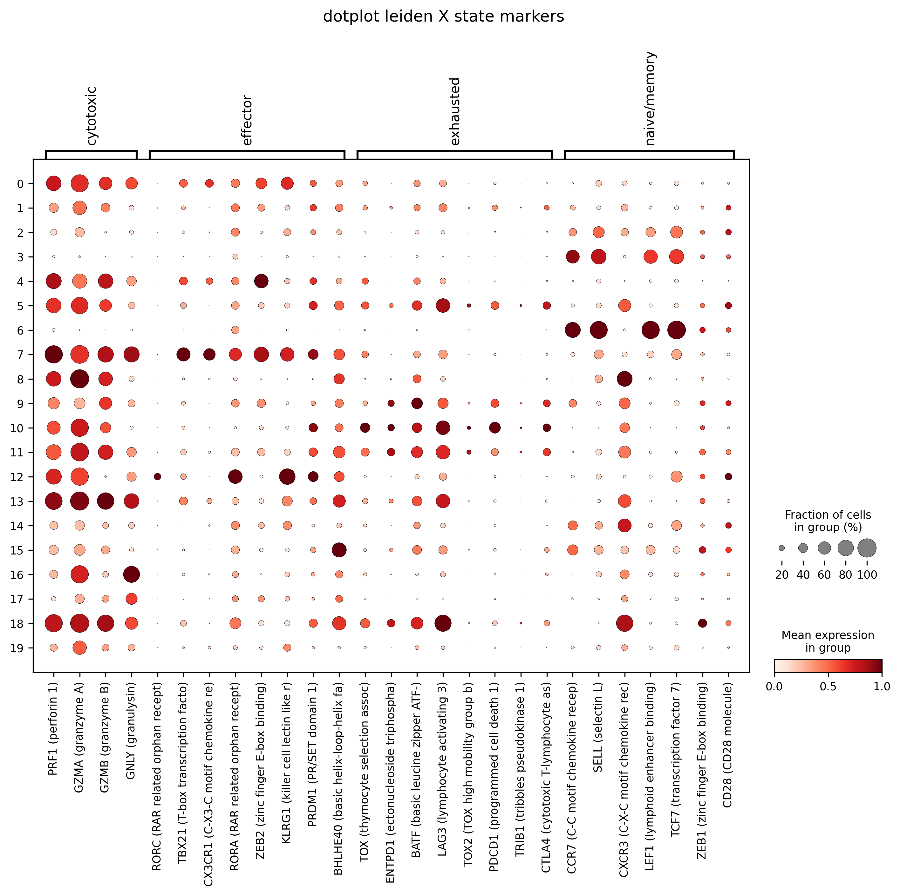
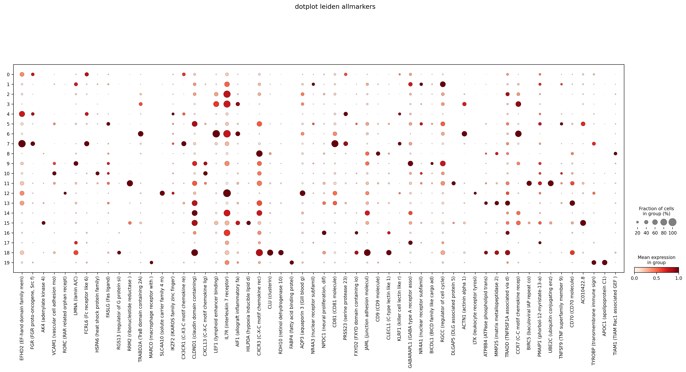

# inhibitory_receptors

- Timestamp: `2026-04-21 08:37:42`
- Source file: `/ceph/project/sharmalab/dnimrich/cd8atlas/code/pipeline_elements.py`

*Loading from [../../data/qc+subsampled_100000.h5ad](../../data/qc+subsampled_100000.h5ad)*

Loaded adata with with shape (91098, 14025)

Preserved existing `counts` layer from loaded adata

Labeled 13256 genes from protein-coding_gene.txt

---
## 3. Feature selection

### 3.3 Highly Variable Gene selection

HVGs selected: 4000 (including 27 whitelisted genes)

### Top 20 expressed genes after selection:

*Loading from [../../code/inhibitory_receptors/inhibitory_receptor_list.csv](../../code/inhibitory_receptors/inhibitory_receptor_list.csv)*

### Missing inhibitory receptor genes: 39, present genes: 40

---
## 4. Dimensional reduction

### Principal component analysis (PCA)

Scaled data with max variance cutoff 10

Calculated PCA with 25 components

### UMAP

Calculated nearest 12 neighbours using 25 PCs

Calculated UMAP with min_dist 0.1 and spread 1.0

---
## 5. Clustering

Detected 20 clusters with leiden at resolution 0.4

*Saving into [inhibitory_receptors_20260421_083742_data/adata_umap_clustering_n=12_mindist=0.1_res=0.4.h5ad](inhibitory_receptors_20260421_083742_data/adata_umap_clustering_n=12_mindist=0.1_res=0.4.h5ad)*

> Saved adata with shape (91098, 4000)

### Labeling states based on markers:

| cytotoxic | effector | exhausted | naive/memory |
| --- | --- | --- | --- |
| IFNG | RORC | TOX | 1D3 |
| PRF1 | TBX21 | ENTPD1 | CCR7 |
| GZMA | CX3CR1 | BATF | SELL |
| GZMB | RORA | LAG3 | CXCR3 |
| GNLY | ZEB2 | TIGID | LEF1 |
|  | KLRG1 | TOX2 | TCF7 |
|  | 1D2 | PDCD1 | ZEB1 |
|  | PRDM1 | TRIB1 | CD28 |
|  | BHLHE40 | CTLA4 |  |

State marker genes in dataset: 27 present, 4 missing

Omitted state markers: 1D2, 1D3, IFNG, TIGID

### Assigned state labels:

| state | n_cells | pct_cells |
| --- | --- | --- |
| cytotoxic | 33294.00 | 36.50 |
| naive/memory | 29498.00 | 32.40 |
| effector | 16136.00 | 17.70 |
| exhausted | 12170.00 | 13.40 |

Plotting 27 genes from adata.var[`state_markers_selected`]

Plotting 27 genes from adata.var[`state_markers_selected`]

---
## 6. FindAllMarkers

### Finding significant genes with FindAllMarkers (via Seurat in R)

FindAllMarkers will use up to 48 R worker(s)

Ran FindAllMarkers in R, keeping up to 3 markers per cluster and selected 56 genes

Plotting 56 genes from adata.var[`findallmarkers_selected`]

### Cluster-to-state summary by `leiden`:

| cluster | n_cells | dominant_state | pct_dominant_state | dominant_cell_subtype_3 | pct_dominant_cell_subtype_3 | top_markers | top_markers_human_readable |
| --- | --- | --- | --- | --- | --- | --- | --- |
| 9.00 | 3555.00 | exhausted | 39.90 | ITGAE+ Tex | 38.00 | CXCL13, LMNA, BICDL1 | CXCL13 (C-X-C motif chemokine lig... |
| 1.00 | 11991.00 | exhausted | 30.60 | ITGAE+ Trm | 42.00 | NR4A3, NR4A1, RGCC | NR4A3 (nuclear receptor subfamil)... |
| 8.00 | 4030.00 | cytotoxic | 80.60 | ZNF683+ Teff | 94.10 | MMP25, CD9, TIAM1 | MMP25 (matrix metallopeptidase 2)... |
| 3.00 | 8746.00 | naive/memory | 93.40 | Tn | 91.70 | ACTN1, AIF1, CCR7 | ACTN1 (actinin alpha 1), AIF1 (al... |
| 12.00 | 2387.00 | effector | 64.60 | MAIT | 93.00 | LTK, SLC4A10, RORC | LTK (leukocyte receptor tyrosi), ... |
| 2.00 | 9059.00 | naive/memory | 69.20 | Tcm | 46.20 | TRADD, IL7R, AQP3 | TRADD (TNFRSF1A associated via d)... |
| 16.00 | 1493.00 | cytotoxic | 66.60 | Early Tcm/Tem | 84.10 | CLECL1, FXYD2, NPDC1 | CLECL1 (C-type lectin like 1), FX... |
| 0.00 | 14753.00 | cytotoxic | 59.70 | GNLY+ Temra | 38.30 | CX3CR1, FGR, FCRL6 | CX3CR1 (C-X3-C motif chemokine re... |
| 7.00 | 4586.00 | cytotoxic | 68.20 | GNLY+ Temra | 43.30 | EFHD2, CD81, TYROBP | EFHD2 (EF-hand domain family mem)... |
| 10.00 | 2963.00 | cytotoxic | 47.10 | GZMK+ Tex | 54.10 | HSPA6, VCAM1, CXCL13 | HSPA6 (heat shock protein family)... |
| 13.00 | 2166.00 | cytotoxic | 91.60 | XBP1+ Tex | 54.30 | MMP25, CD70, ATP8B4 | MMP25 (matrix metallopeptidase 2)... |
| 14.00 | 2057.00 | naive/memory | 62.10 | GZMK+ Tem | 37.40 | JAML, CLDND1, CXCR3 | JAML (junction adhesion molecul),... |
| 11.00 | 2833.00 | cytotoxic | 54.40 | Cycling T | 97.50 | UBE2C, DLGAP5, BIRC5 | UBE2C (ubiquitin conjugating enz)... |
| 6.00 | 5157.00 | naive/memory | 99.70 | Tn | 97.80 | LEF1, ACTN1, TRABD2A | LEF1 (lymphoid enhancer binding),... |
| 5.00 | 5176.00 | cytotoxic | 38.60 | GZMK+ Tex | 25.20 | TNFSF9, FASLG, AC010422.8 | TNFSF9 (TNF superfamily member 9)... |
| 4.00 | 5295.00 | cytotoxic | 61.70 | CMC1+ Temra | 87.00 | KLRF1, PRSS23, IKZF2 | KLRF1 (killer cell lectin like r)... |
| 17.00 | 1403.00 | effector | 33.10 | GNLY+ Temra | 35.80 | GABARAPL1, PMAIP1, LMNA | GABARAPL1 (GABA type A receptor a... |
| 18.00 | 1283.00 | cytotoxic | 82.70 | XBP1+ Tex | 62.00 | RGS13, RDH10, CLU | RGS13 (regulator of G protein si)... |
| 15.00 | 1522.00 | naive/memory | 50.10 | Cycling T | 29.40 | HILPDA, AK4, RRM2 | HILPDA (hypoxia inducible lipid d... |
| 19.00 | 643.00 | cytotoxic | 50.70 | CMC1+ Temra | 34.20 | FABP4, MARCO, APOC1 | FABP4 (fatty acid binding protei)... |

