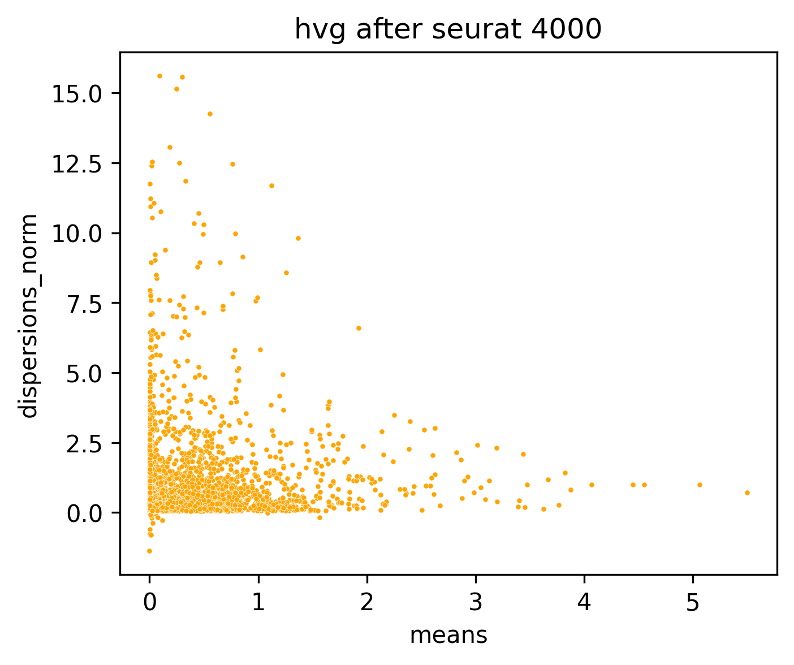
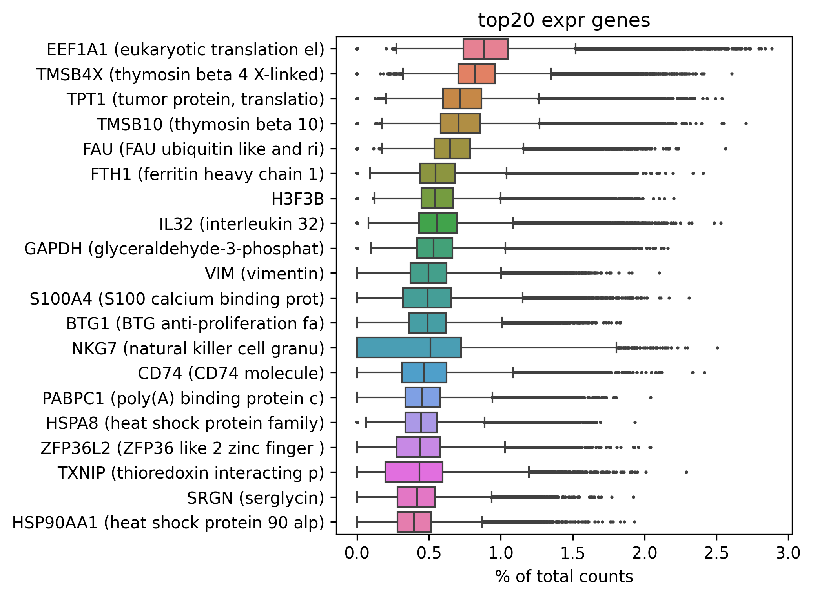
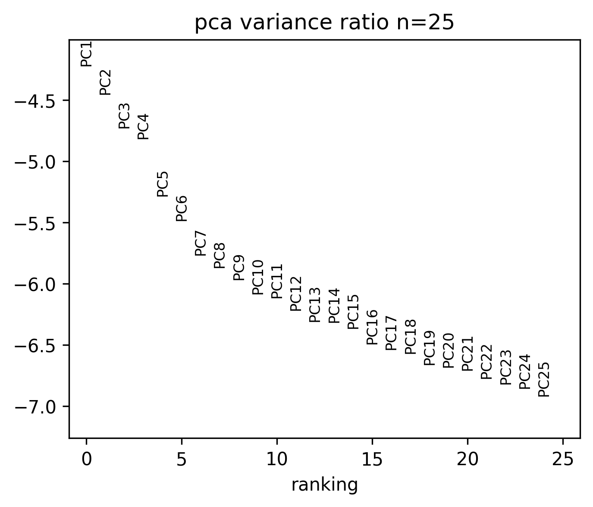
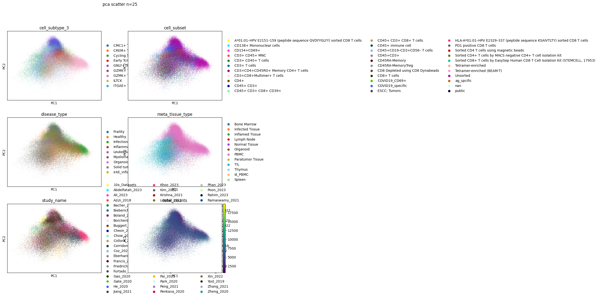
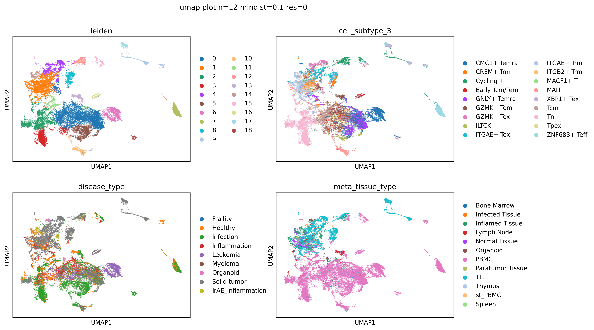
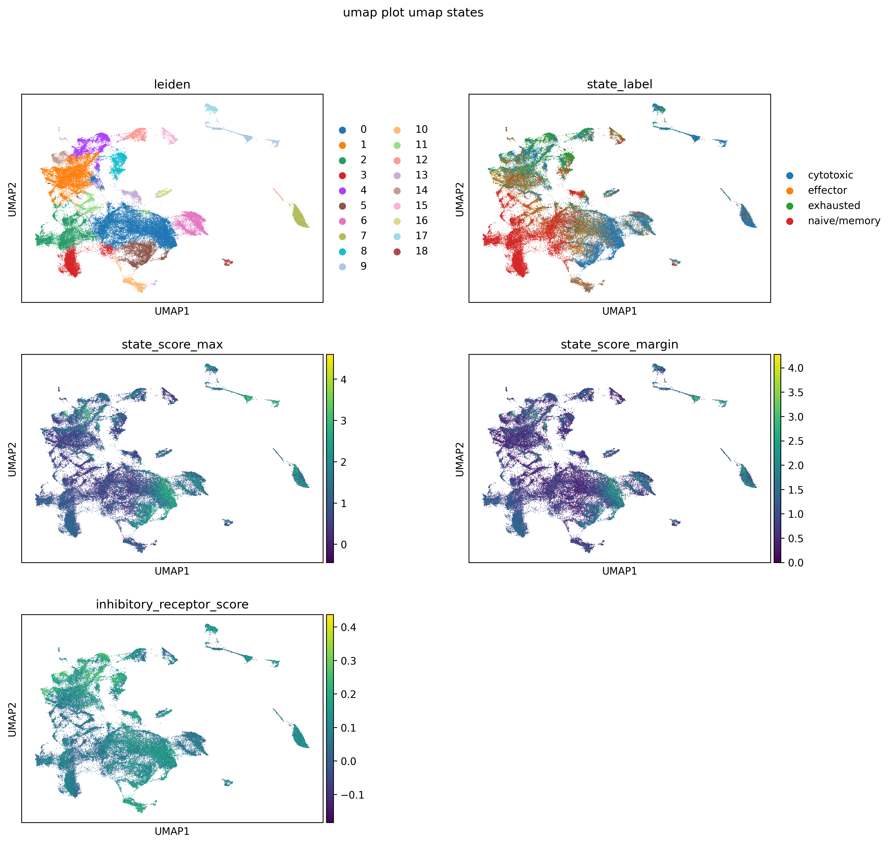
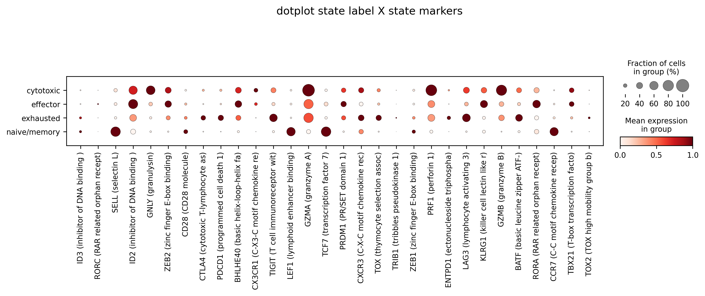
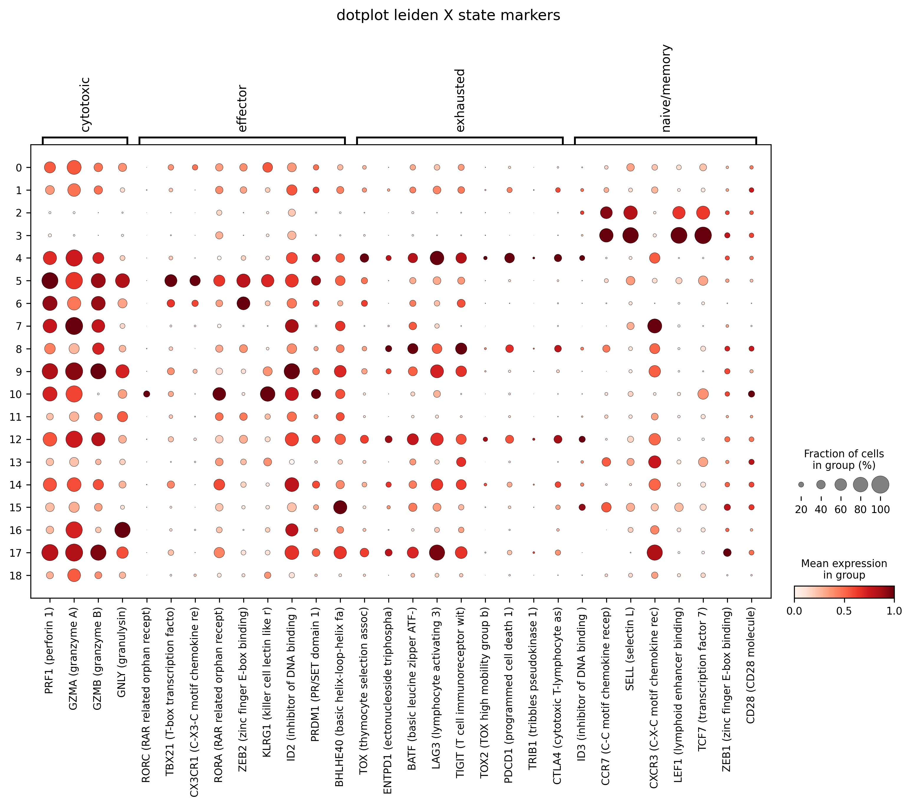
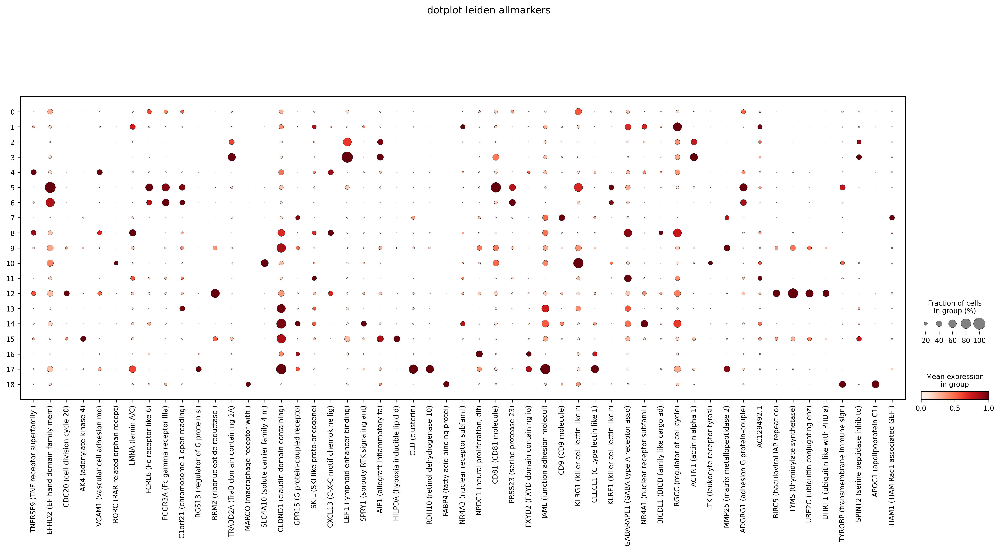
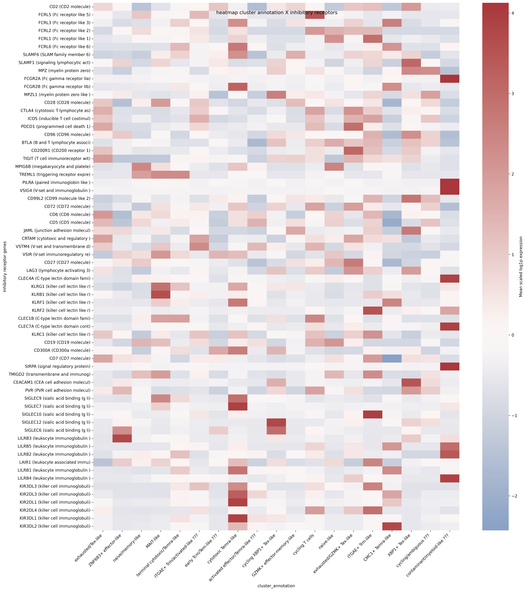

# inhibitory_receptors

- Timestamp: `2026-04-21 11:00:22`
- Source file: `/ceph/project/sharmalab/dnimrich/cd8atlas/code/pipeline_elements.py`

*Loading from [../../data/qc+subsampled_100000.h5ad](../../data/qc+subsampled_100000.h5ad)*

Loaded adata with with shape (91098, 14025)

Preserved existing `counts` layer from loaded adata

Labeled 13256 genes from protein-coding_gene.txt

*Loading from [../../code/inhibitory_receptors/inhibitory_receptor_list.csv](../../code/inhibitory_receptors/inhibitory_receptor_list.csv)*

---
## 3. Feature selection

### 3.3 Highly Variable Gene selection

HVGs selected: 4016 (including 90 whitelisted genes)

### Top 20 expressed genes after selection:

### Missing inhibitory receptor genes: 30, present genes: 66

---
## 4. Dimensional reduction

### Principal component analysis (PCA)

Scaled data with max variance cutoff 10

Calculated PCA with 25 components

### UMAP

Calculated nearest 12 neighbours using 25 PCs

Calculated UMAP with min_dist 0.1 and spread 1.0

---
## 5. Clustering

Detected 19 clusters with leiden at resolution 0.4

*Saving into [inhibitory_receptors_20260421_110022_data/adata_umap_clustering_n=12_mindist=0.1_res=0.4.h5ad](inhibitory_receptors_20260421_110022_data/adata_umap_clustering_n=12_mindist=0.1_res=0.4.h5ad)*

> Saved adata with shape (91098, 4016)

### Calculated inhibitory receptor score from 66 genes

### Labeling states based on markers:

| cytotoxic | effector | exhausted | naive/memory |
| --- | --- | --- | --- |
| IFNG1 | RORC | TOX | ID3 |
| PRF1 | TBX21 | ENTPD1 | CCR7 |
| GZMA | CX3CR1 | BATF | SELL |
| GZMB | RORA | LAG3 | CXCR3 |
| GNLY | ZEB2 | TIGIT | LEF1 |
|  | KLRG1 | TOX2 | TCF7 |
|  | ID2 | PDCD1 | ZEB1 |
|  | PRDM1 | TRIB1 | CD28 |
|  | BHLHE40 | CTLA4 |  |

State marker genes in dataset: 30 present, 1 missing

Omitted state markers: IFNG1

### Assigned state labels:

| state | n_cells | pct_cells |
| --- | --- | --- |
| cytotoxic | 34959.00 | 38.40 |
| naive/memory | 26664.00 | 29.30 |
| exhausted | 15722.00 | 17.30 |
| effector | 13753.00 | 15.10 |

*Loading from [../../data/cluster_state_summary_names.csv](../../data/cluster_state_summary_names.csv)*

Loaded manual cluster annotations from cluster_state_summary_names.csv into adata.obs['cluster_annotation']

Plotting 30 genes from adata.var[`state_markers_selected`]

Plotting 30 genes from adata.var[`state_markers_selected`]

---
## 6. FindAllMarkers

### Finding significant genes with FindAllMarkers (via Seurat in R)

parallelising with up to 48 R worker(s)

Ran FindAllMarkers in R, keeping up to 3 markers per cluster and selected 53 genes

Plotting 53 genes from adata.var[`findallmarkers_selected`]

### Cluster-to-state summary by `leiden`:

| cluster | n_cells | dominant_state | pct_dominant_state | dominant_cell_subtype_3 | pct_dominant_cell_subtype_3 | top_markers |
| --- | --- | --- | --- | --- | --- | --- |
| 8.00 | 3606.00 | exhausted | 57.00 | ITGAE+ Tex | 38.80 | CXCL13 (C-X-C motif chemokine lig); LMNA (lamin A/C); BICDL1 (BICD family like cargo ad) |
| 7.00 | 4029.00 | cytotoxic | 80.30 | ZNF683+ Teff | 94.20 | MMP25 (matrix metallopeptidase 2); CD9 (CD9 molecule); TIAM1 (TIAM Rac1 associated GEF ) |
| 2.00 | 8883.00 | naive/memory | 90.90 | Tn | 87.30 | ACTN1 (actinin alpha 1); AIF1 (allograft inflammatory fa); SPINT2 (serine peptidase inhibito) |
| 10.00 | 2431.00 | effector | 53.00 | MAIT | 92.40 | LTK (leukocyte receptor tyrosi); SLC4A10 (solute carrier family 4 m); RORC (RAR related orphan recept) |
| 0.00 | 21773.00 | cytotoxic | 42.90 | GNLY+ Temra | 23.20 | FCRL6 (Fc receptor like 6); KLRG1 (killer cell lectin like r); ADGRG1 (adhesion G protein-couple) |
| 1.00 | 12667.00 | exhausted | 30.60 | ITGAE+ Trm | 39.90 | NR4A3 (nuclear receptor subfamil); NR4A1 (nuclear receptor subfamil); RGCC (regulator of cell cycle) |
| 16.00 | 1447.00 | cytotoxic | 60.10 | Early Tcm/Tem | 85.60 | CLECL1 (C-type lectin like 1); FXYD2 (FXYD domain containing io); NPDC1 (neural proliferation, dif) |
| 5.00 | 5375.00 | cytotoxic | 71.20 | GNLY+ Temra | 38.90 | TYROBP (transmembrane immune sign); EFHD2 (EF-hand domain family mem); CD81 (CD81 molecule) |
| 11.00 | 2365.00 | effector | 41.90 | GNLY+ Temra | 41.40 | GABARAPL1 (GABA type A receptor asso); SKIL (SKI like proto-oncogene); AC129492.1 |
| 9.00 | 2949.00 | cytotoxic | 85.10 | XBP1+ Tex | 40.00 | UBE2C (ubiquitin conjugating enz); TYMS (thymidylate synthetase); MMP25 (matrix metallopeptidase 2) |
| 13.00 | 2045.00 | naive/memory | 58.40 | GZMK+ Tem | 36.90 | JAML (junction adhesion molecul); C1orf21 (chromosome 1 open reading); CLDND1 (claudin domain containing) |
| 12.00 | 2071.00 | cytotoxic | 48.10 | Cycling T | 96.50 | UHRF1 (ubiquitin like with PHD a); BIRC5 (baculoviral IAP repeat co); CDC20 (cell division cycle 20) |
| 3.00 | 6025.00 | naive/memory | 98.20 | Tn | 85.90 | LEF1 (lymphoid enhancer binding); ACTN1 (actinin alpha 1); TRABD2A (TraB domain containing 2A) |
| 4.00 | 5390.00 | exhausted | 47.90 | GZMK+ Tex | 51.20 | VCAM1 (vascular cell adhesion mo); CXCL13 (C-X-C motif chemokine lig); TNFRSF9 (TNF receptor superfamily ) |
| 14.00 | 1558.00 | cytotoxic | 40.50 | ITGAE+ Trm | 53.30 | SPRY1 (sprouty RTK signaling ant); GPR15 (G protein-coupled recepto); NR4A1 (nuclear receptor subfamil) |
| 6.00 | 4992.00 | cytotoxic | 71.20 | CMC1+ Temra | 91.90 | KLRF1 (killer cell lectin like r); PRSS23 (serine protease 23); FCGR3A (Fc gamma receptor IIIa) |
| 17.00 | 1257.00 | cytotoxic | 66.10 | XBP1+ Tex | 63.30 | RGS13 (regulator of G protein si); RDH10 (retinol dehydrogenase 10); CLU (clusterin) |
| 15.00 | 1529.00 | naive/memory | 41.30 | Cycling T | 29.50 | HILPDA (hypoxia inducible lipid d); AK4 (adenylate kinase 4); RRM2 (ribonucleotide reductase ) |
| 18.00 | 706.00 | cytotoxic | 47.90 | CMC1+ Temra | 30.90 | FABP4 (fatty acid binding protei); MARCO (macrophage receptor with ); APOC1 (apolipoprotein C1) |

*Saving into [inhibitory_receptors_20260421_110022_data/cluster_state_summary.csv](inhibitory_receptors_20260421_110022_data/cluster_state_summary.csv)*

Saved cluster summary CSV for manual annotation: cluster_state_summary.csv

