# test_pipeline

- Timestamp: `2026-03-20 10:58:18`
- Source file: `/ceph/project/sharmalab/dnimrich/<stdin>`

*Loading from [../../data/subsampled_100000.h5ad](../../data/subsampled_100000.h5ad)*

Loaded subsampled data with shape (100000, 19957)

---
## 1. Quality Control

### 1.1 Ambient RNA QC

Checking if a cleanup is necessary, flagging cells with less than 1000 counts as potential ambient RNA contamination

No significant RNA contamination detected, skipping cleanup

### 1.2 Count QC

| index | count | mean | std | min | 25% | 50% | 75% | max |
| --- | --- | --- | --- | --- | --- | --- | --- | --- |
| total_counts | 100000.00 | 3924.63 | 2698.54 | 248.00 | 2350.00 | 3424.00 | 4779.00 | 65975.00 |
| n_genes_by_counts | 100000.00 | 1434.59 | 638.66 | 201.00 | 1009.00 | 1346.00 | 1730.00 | 6872.00 |
| pct_counts_mt | 100000.00 | 4.61 | 2.41 | 0.00 | 3.02 | 4.26 | 5.73 | 47.37 |
| pct_counts_ribo | 100000.00 | 28.53 | 9.60 | 0.68 | 21.57 | 27.68 | 35.02 | 64.87 |
| pct_counts_hb | 100000.00 | 0.01 | 0.23 | 0.00 | 0.00 | 0.00 | 0.00 | 49.51 |
| pct_counts_in_top_20_genes | 100000.00 | 20.88 | 3.43 | 8.44 | 18.47 | 20.55 | 22.95 | 59.58 |

Number of count outliers with `MAD > 5`: 1548

Number of mitochondrial outliers with `MAD > 5`: 8020

[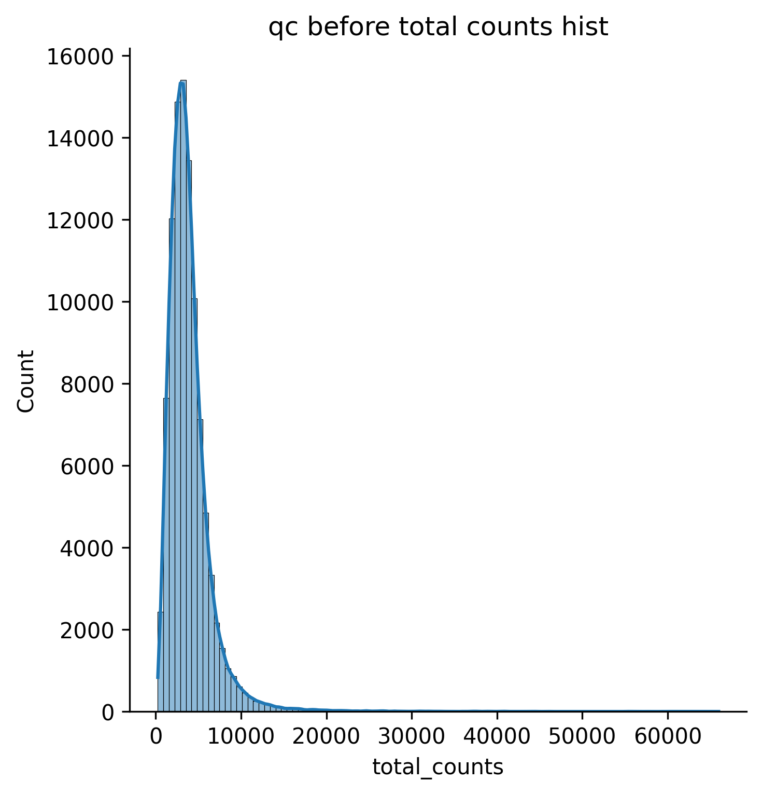](test_pipeline_20260320_105818_figures/qc_before_total_counts_hist.png)
[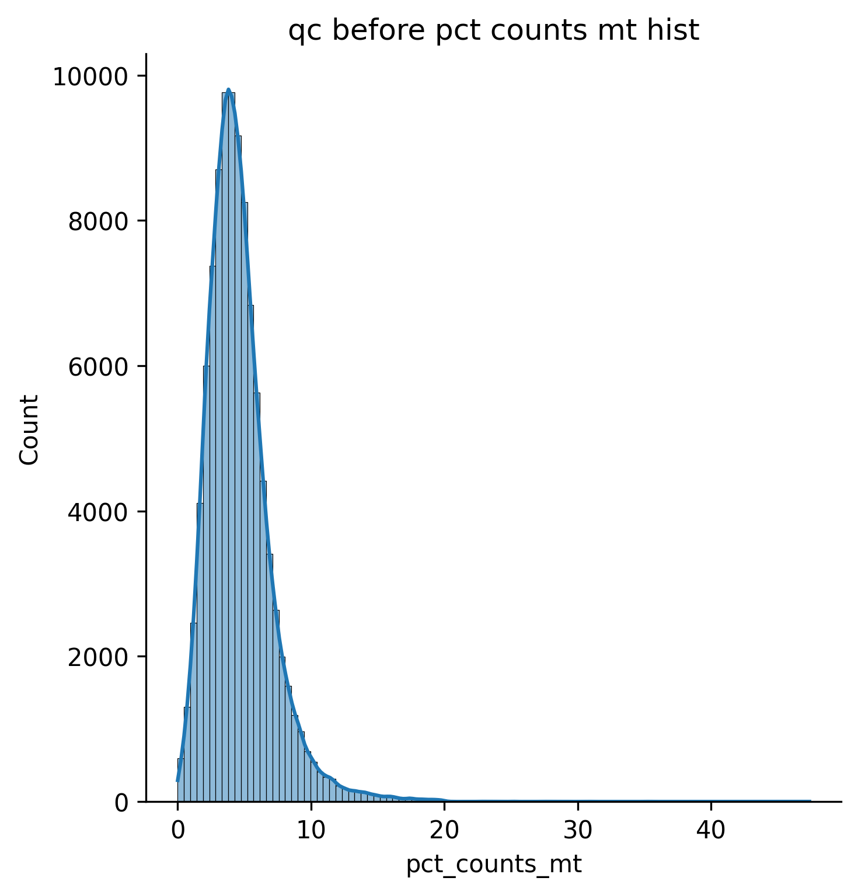](test_pipeline_20260320_105818_figures/qc_before_pct_counts_mt_hist.png)
[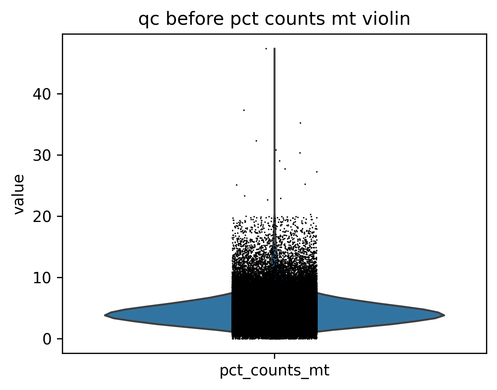](test_pipeline_20260320_105818_figures/qc_before_pct_counts_mt_violin.png)
[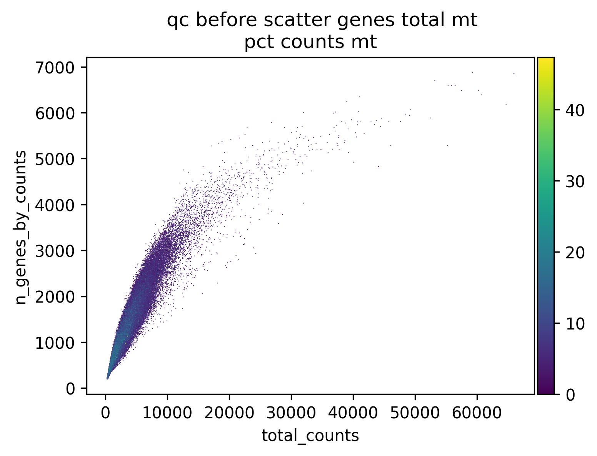](test_pipeline_20260320_105818_figures/qc_before_scatter_genes_total_mt.png)

Size of matrix before count filtering: (100000, 19957)

Size of matrix after count filtering: (90828, 19832) (removed 9.17% cells)

Filtering out genes expressed in less than 20 cells

Removed 14250 cells (28.15%)

#### After count QC:

[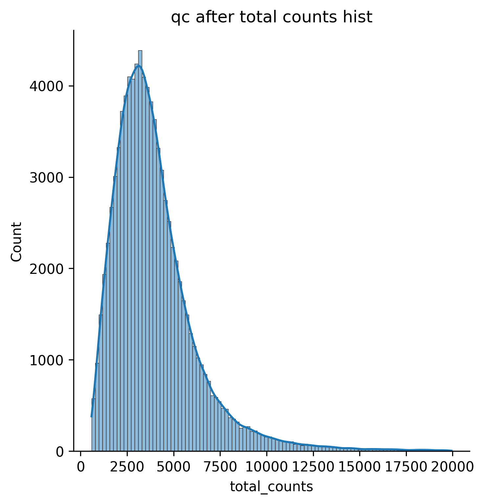](test_pipeline_20260320_105818_figures/qc_after_total_counts_hist.png)
[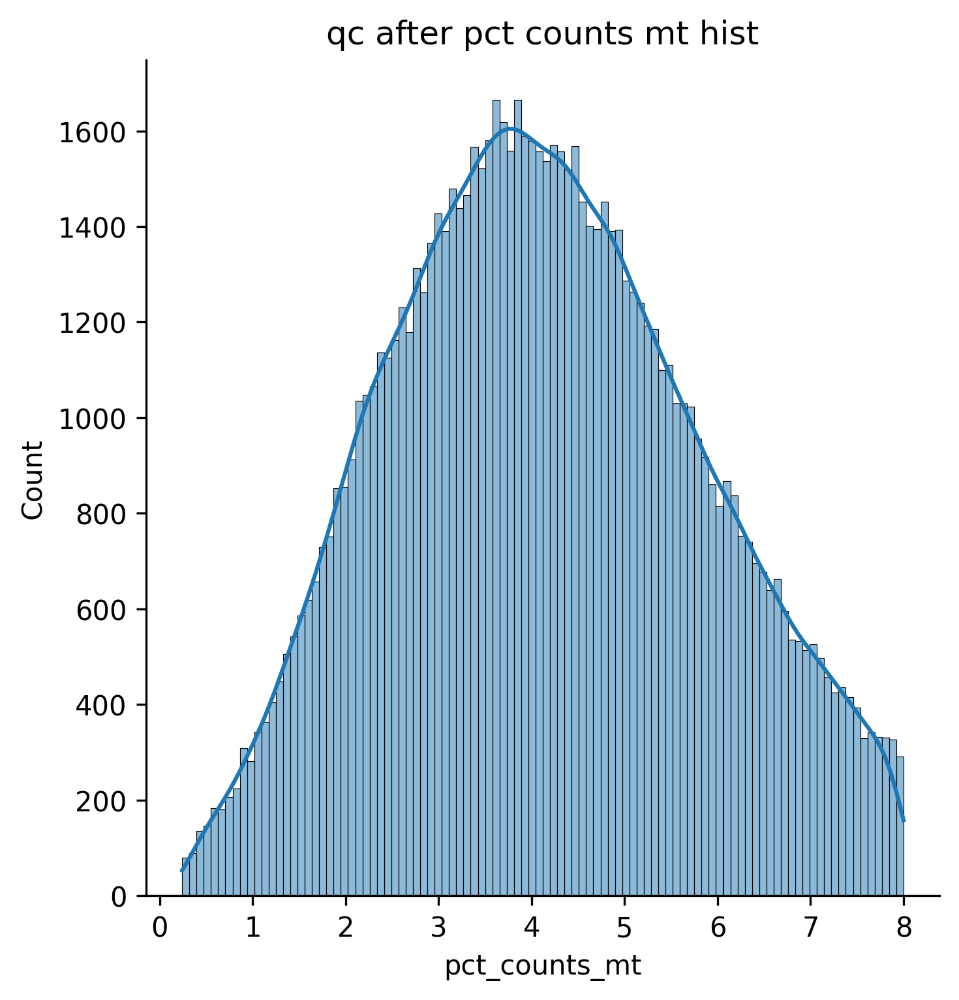](test_pipeline_20260320_105818_figures/qc_after_pct_counts_mt_hist.png)
[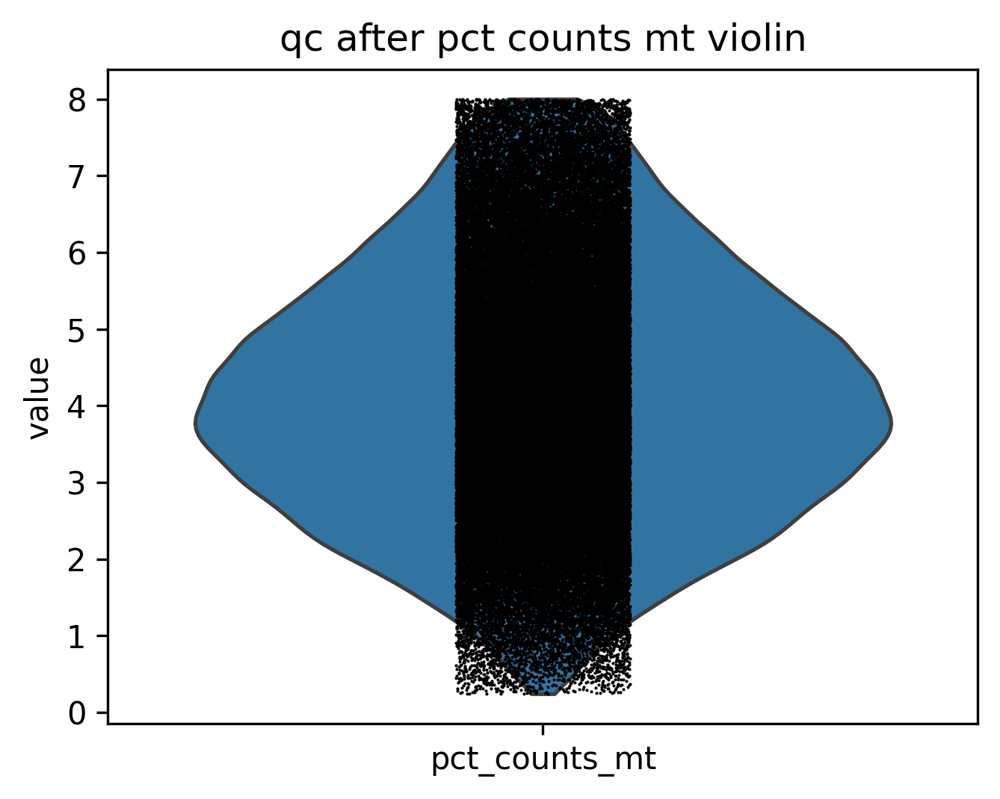](test_pipeline_20260320_105818_figures/qc_after_pct_counts_mt_violin.png)
[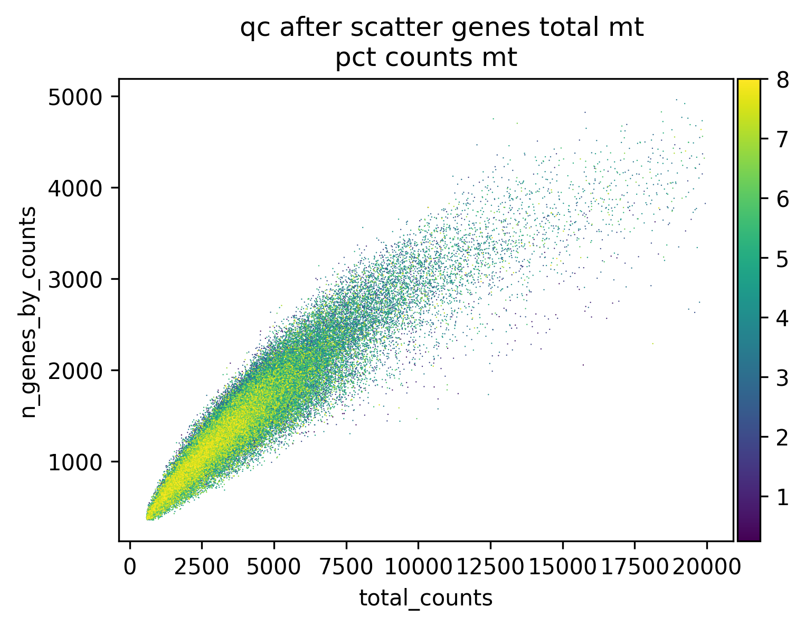](test_pipeline_20260320_105818_figures/qc_after_scatter_genes_total_mt.png)

---
## 2. Normalisation

Normalised in reference to total counts

Transformed with log1p

[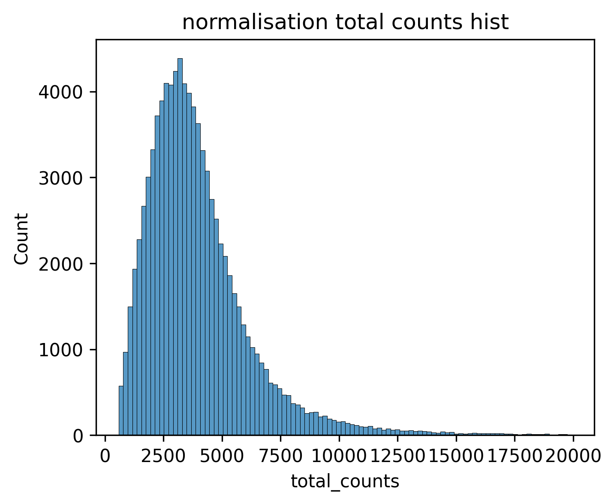](test_pipeline_20260320_105818_figures/normalisation_total_counts_hist.png)
[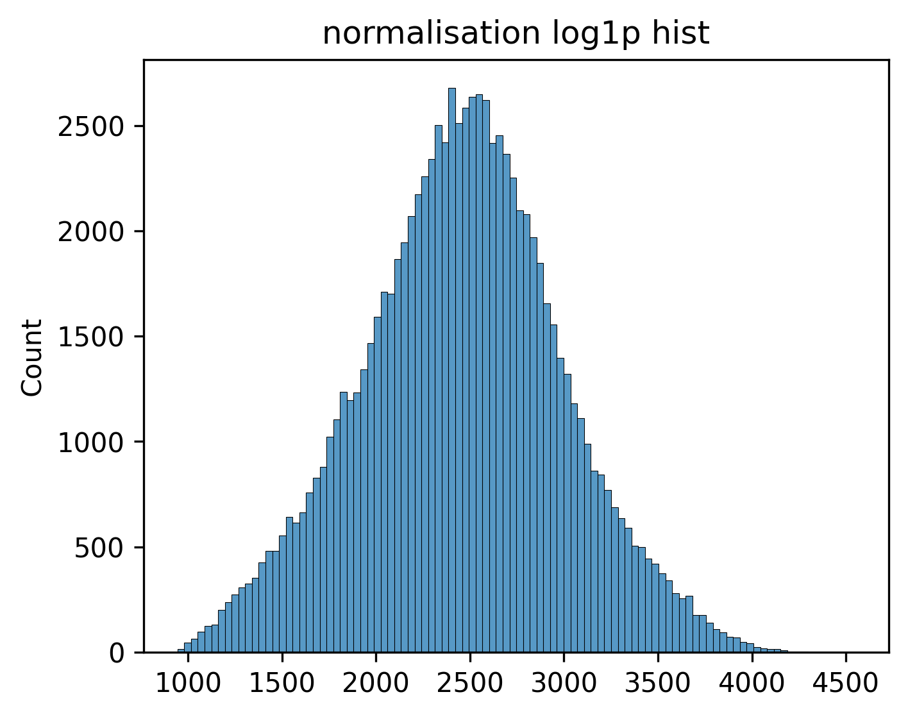](test_pipeline_20260320_105818_figures/normalisation_log1p_hist.png)

*Saving into [test_pipeline_20260320_105818_data/qc+normalised.h5ad](test_pipeline_20260320_105818_data/qc+normalised.h5ad)*

Saved adata of shape (90828, 14250)

---
## 3. Feature selection

### 3.2 Gene exclusion

Excluding genes matching the following patterns:

|  |  |
| --- | --- |
| stress_genes | ['G0S2', '^JUN', '^FOS', 'CDKN1A'] |
| cc_genes | ['CDC20', 'CCNB2', 'DLGAP5', 'PLK... |
| IFN_genes | ['^IRF', '^IFN'] |
| ccl_genes | ['CCL'] |
| MHC_genes | ['^HLA-[A-Z]'] |
| hist_genes | ['HIST'] |
| comp_genes | ['^C1Q'] |
| ig_genes | ['^IGH', '^IGK', '^IGL'] |
| hb_genes | ['^HBA\|^HBB'] |
| miscelaneous_bad_features | [] |

Removing 285 genes (2.00%)

Shape after exclusion panel filtering: (90828, 13965)

### 3.3 Highly Variable Gene selection

HVGs selected: 4000

[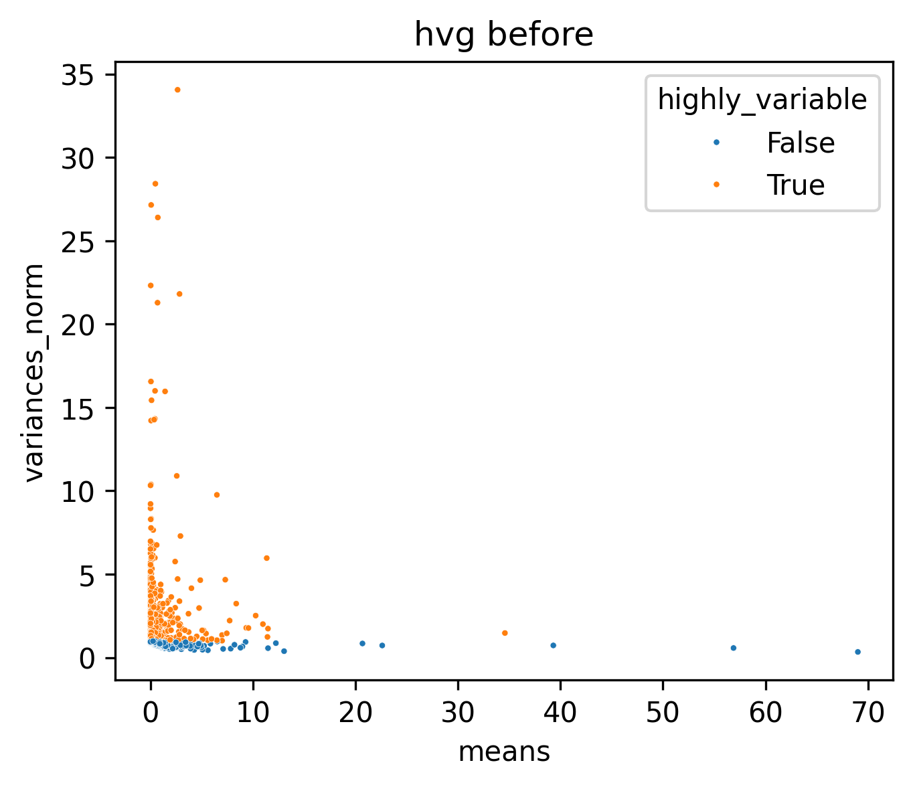](test_pipeline_20260320_105818_figures/hvg_before.png)
[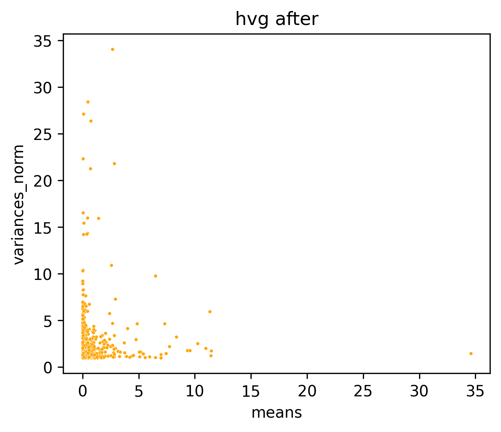](test_pipeline_20260320_105818_figures/hvg_after.png)

---
## 3. Feature selection

### 3.2 Gene exclusion

Excluding genes matching the following patterns:

|  |  |
| --- | --- |
| stress_genes | ['G0S2', '^JUN', '^FOS', 'CDKN1A'] |
| cc_genes | ['CDC20', 'CCNB2', 'DLGAP5', 'PLK... |
| IFN_genes | ['^IRF', '^IFN'] |
| ccl_genes | ['CCL'] |
| MHC_genes | ['^HLA-[A-Z]'] |
| hist_genes | ['HIST'] |
| comp_genes | ['^C1Q'] |
| ig_genes | ['^IGH', '^IGK', '^IGL'] |
| hb_genes | ['^HBA\|^HBB'] |
| miscelaneous_bad_features | [] |

Removing 0 genes (0.00%)

Shape after exclusion panel filtering: (90828, 4000)

### 3.3 Highly Variable Gene selection

HVGs selected: 4000

*Loading from [test_pipeline_20260320_105818_data/qc+normalised.h5ad](test_pipeline_20260320_105818_data/qc+normalised.h5ad)*

Loaded data with shape (90828, 14250)

---
## 3. Feature selection

### 3.2 Gene exclusion

Excluding genes matching the following patterns:

|  |  |
| --- | --- |
| stress_genes | ['G0S2', '^JUN', '^FOS', 'CDKN1A'] |
| cc_genes | ['CDC20', 'CCNB2', 'DLGAP5', 'PLK... |
| IFN_genes | ['^IRF', '^IFN'] |
| ccl_genes | ['CCL'] |
| MHC_genes | ['^HLA-[A-Z]'] |
| hist_genes | ['HIST'] |
| comp_genes | ['^C1Q'] |
| ig_genes | ['^IGH', '^IGK', '^IGL'] |
| hb_genes | ['^HBA\|^HBB'] |
| miscelaneous_bad_features | [] |

Removing 285 genes (2.00%)

Shape after exclusion panel filtering: (90828, 13965)

### 3.3 Highly Variable Gene selection - SEURAT V3

HVGs selected: 4000

*Loading from [test_pipeline_20260320_105818_data/qc+normalised.h5ad](test_pipeline_20260320_105818_data/qc+normalised.h5ad)*

Loaded data with shape (90828, 14250)

---
## 3. Feature selection

### 3.2 Gene exclusion

Excluding genes matching the following patterns:

|  |  |
| --- | --- |
| stress_genes | ['G0S2', '^JUN', '^FOS', 'CDKN1A'] |
| cc_genes | ['CDC20', 'CCNB2', 'DLGAP5', 'PLK... |
| IFN_genes | ['^IRF', '^IFN'] |
| ccl_genes | ['CCL'] |
| MHC_genes | ['^HLA-[A-Z]'] |
| hist_genes | ['HIST'] |
| comp_genes | ['^C1Q'] |
| ig_genes | ['^IGH', '^IGK', '^IGL'] |
| hb_genes | ['^HBA\|^HBB'] |
| miscelaneous_bad_features | [] |

Removing 285 genes (2.00%)

Shape after exclusion panel filtering: (90828, 13965)

### 3.3 Highly Variable Gene selection - SEURAT V3

HVGs selected: 3000

[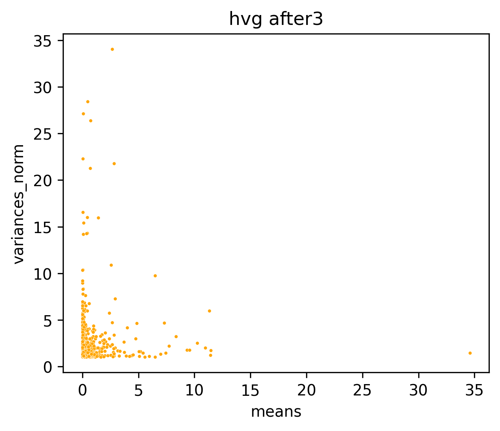](test_pipeline_20260320_105818_figures/hvg_after3.png)

*Loading from [test_pipeline_20260320_105818_data/qc+normalised.h5ad](test_pipeline_20260320_105818_data/qc+normalised.h5ad)*

Loaded data with shape (90828, 14250)

---
## 3. Feature selection

### 3.2 Gene exclusion

Excluding genes matching the following patterns:

|  |  |
| --- | --- |
| stress_genes | ['G0S2', '^JUN', '^FOS', 'CDKN1A'] |
| cc_genes | ['CDC20', 'CCNB2', 'DLGAP5', 'PLK... |
| IFN_genes | ['^IRF', '^IFN'] |
| ccl_genes | ['CCL'] |
| MHC_genes | ['^HLA-[A-Z]'] |
| hist_genes | ['HIST'] |
| comp_genes | ['^C1Q'] |
| ig_genes | ['^IGH', '^IGK', '^IGL'] |
| hb_genes | ['^HBA\|^HBB'] |
| miscelaneous_bad_features | [] |

Removing 285 genes (2.00%)

Shape after exclusion panel filtering: (90828, 13965)

### 3.3 Highly Variable Gene selection - SEURAT V3

HVGs selected: 2000

[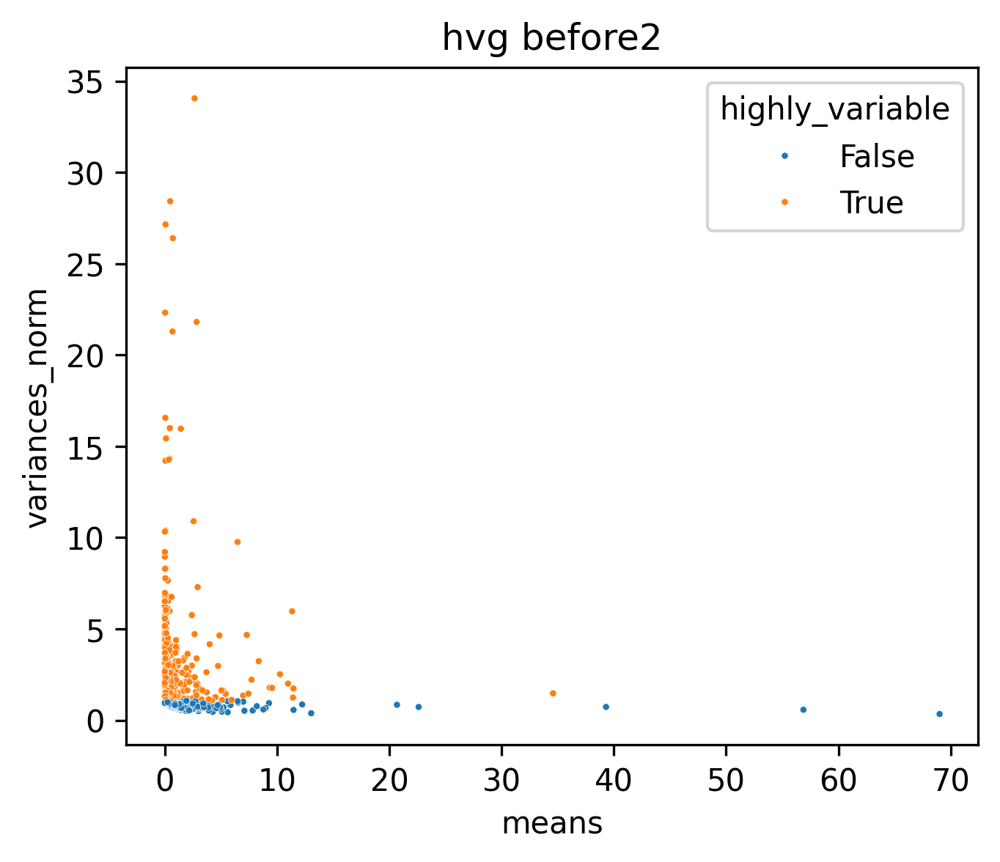](test_pipeline_20260320_105818_figures/hvg_before2.png)
[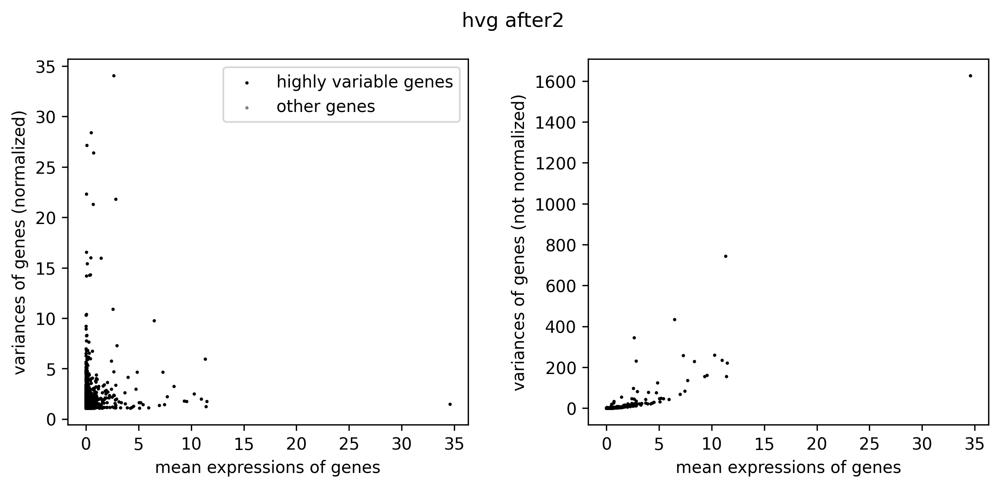](test_pipeline_20260320_105818_figures/hvg_after2.png)

### Top 20 expressed genes after selection:

[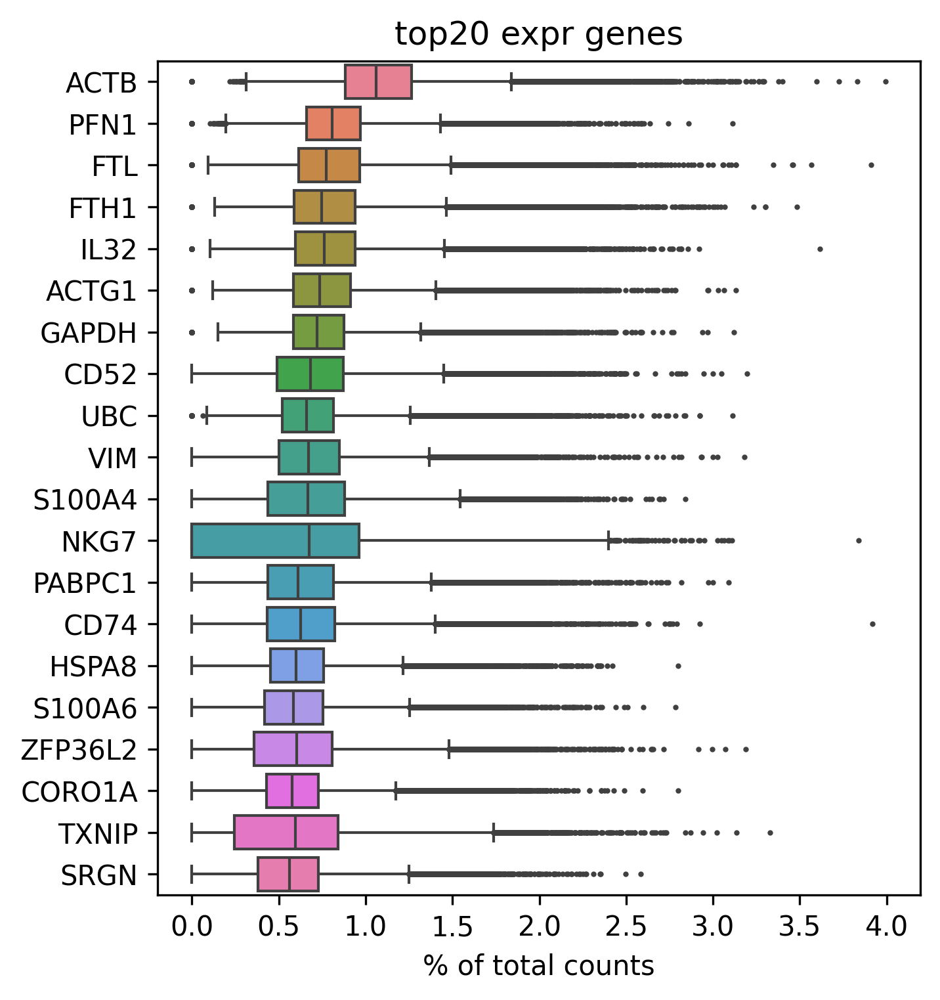](test_pipeline_20260320_105818_figures/top20_expr_genes.png)

