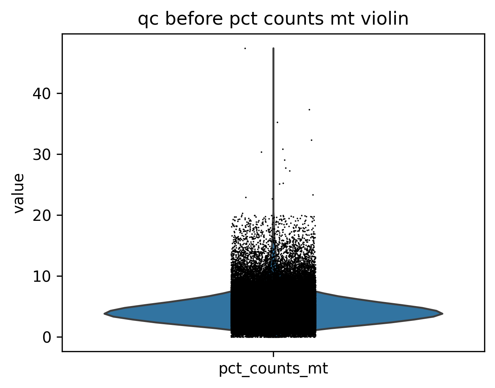
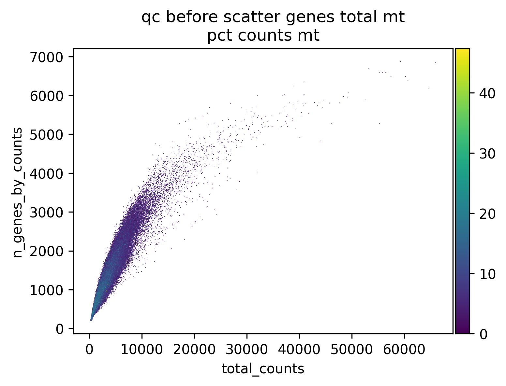

# test_pipeline

- Timestamp: `2026-03-20 03:40:11`
- Source file: `/ceph/project/sharmalab/dnimrich/cd8atlas/job_logs/<stdin>`

*Loading from [test_pipeline/data/subsampled_100000.h5ad](test_pipeline/data/subsampled_100000.h5ad)*

Loaded subsampled data with shape (100000, 19957)

---
## Quality Control

### Ambient RNA QC

Checking if a cleanup is necessary, flagging cells with less than 1000 counts as potential ambient RNA contamination

No significant RNA contamination detected, skipping cleanup

### Count QC

| index | count | mean | std | min | 25% | 50% | 75% | max |
| --- | --- | --- | --- | --- | --- | --- | --- | --- |
| total_counts | 100000.00 | 3924.63 | 2698.54 | 248.00 | 2350.00 | 3424.00 | 4779.00 | 65975.00 |
| n_genes_by_counts | 100000.00 | 1434.59 | 638.66 | 201.00 | 1009.00 | 1346.00 | 1730.00 | 6872.00 |
| pct_counts_mt | 100000.00 | 4.61 | 2.41 | 0.00 | 3.02 | 4.26 | 5.73 | 47.37 |
| pct_counts_ribo | 100000.00 | 28.53 | 9.60 | 0.68 | 21.57 | 27.68 | 35.02 | 64.87 |
| pct_counts_hb | 100000.00 | 0.01 | 0.23 | 0.00 | 0.00 | 0.00 | 0.00 | 49.51 |
| pct_counts_in_t... | 100000.00 | 20.88 | 3.43 | 8.44 | 18.47 | 20.55 | 22.95 | 59.58 |

count outliers with MAD:1548

mitochondrial outliers with MAD:8020

*Saving into [test_pipeline_20260320_034011_data/qc+normalised.h5ad](test_pipeline_20260320_034011_data/qc+normalised.h5ad)*

Saved adata of shape (100000, 19957)
